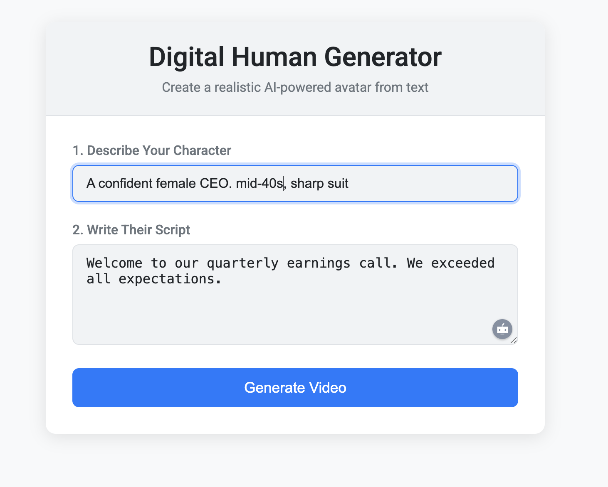
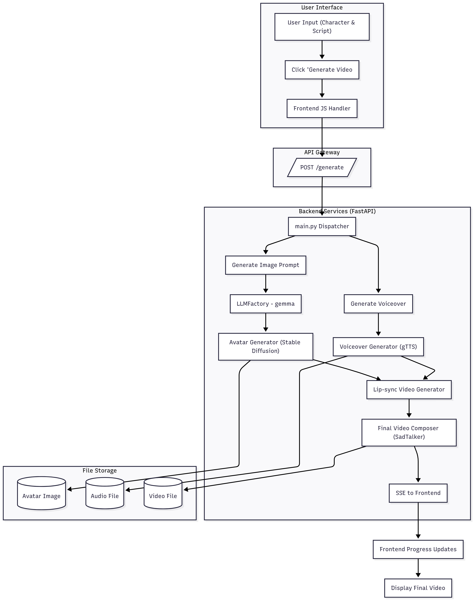
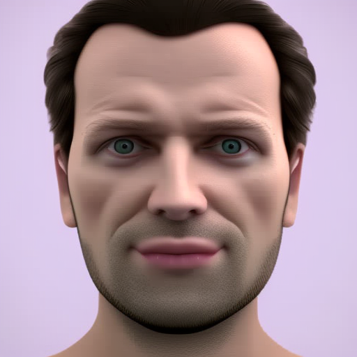

# Digital Human RAG Agent

This project is a web-based application that creates a "digital human" video from a text description and a script. It uses a combination of local Large Language Models (LLMs), image generation, text-to-speech, and lip-syncing technologies to generate a talking avatar.



## Features

-   **Professional UI**: A clean, modern, and responsive light-themed interface.
-   **Real-Time Progress**: A multi-stage progress bar provides detailed feedback during generation.
-   **Generation Time Display**: The total time taken to generate the video is displayed upon completion.
-   **Customizable Avatars**: Describe the character you want to create using natural language.
-   **End-to-End Pipeline**: Automatically handles the entire video generation process.
-   **Local Model Support**: Optimized to run on local hardware.
-   **GPU Acceleration**: Leverages Apple Silicon's GPU (MPS) for faster image generation, with automatic fallback to CPU if needed.

For a deep dive into the technical architecture, see the [**Technical Overview**](docs/technical_overview.md).

## Architecture and Models

The application follows a multi-stage pipeline, orchestrating several AI models and services to generate the final video. The diagram below provides a detailed look at the architecture and data flow.



## How It Works: A Visual Demo

The application takes a character description and a script and generates a lip-synced video in four main stages.

### 1. User Input

It all starts with your idea. You provide a description of the character and the script they will speak.

**Input:**
-   **Character**: `European Male`
-   **Script**: `Hello, how are you doing?`

### 2. Avatar Generation

The application uses Stable Diffusion to generate a unique, realistic avatar based on your description.

**Generated Avatar Image:**


### 3. Voice Synthesis & Video Rendering

The script is converted into speech, and SadTalker animates the avatar's lips to match the audio, producing the final video.

### 4. Final Output

The result is a complete, lip-synced video, ready to view and download.

**Final Video Output:**

https://github.com/user-attachments/assets/95958567-b52b-4024-81b4-e34989e2c45f

## Output Files

All generated files are saved to the `output/` directory at the root of the project:

-   **Avatar Image**: `output/images/source_image.png`
-   **Audio File**: `output/audio/audio.wav`
-   **Final Video**: `output/videos/generated_video.mp4`
-   **Temporary Files**: `output/temp_results/`

## Performance & Speed

The video generation process is computationally intensive. Here are some key factors and how to speed it up:

-   **GPU vs. CPU**: The application is optimized for Apple Silicon (M1/M2/M3) GPUs (MPS). Image generation on GPU is **5-10x faster** than on CPU. The app will automatically use the GPU if available and will fall back to the CPU if it fails.
-   **SadTalker**: The video rendering step (`SadTalker`) is the most time-consuming part and runs on the CPU.
-   **Script Length**: Shorter scripts result in shorter audio files and significantly faster video rendering times. A 10-second clip will render much faster than a 60-second clip.

**To get the fastest results, use a machine with an Apple Silicon chip and keep your scripts concise.**

### Video Quality vs. Speed

For even faster video generation, this project disables the **GFPGAN face enhancer** by default. Disabling it can make the video rendering **2-3x faster**, but it may result in slightly lower facial clarity in the final video.

If you prefer higher quality over speed, you can re-enable it:

1.  Open the file `src/video_generator.py`.
2.  Find the `command` list (around line 40).
3.  Add the enhancer flag back into the list:

    ```python
    command = [
        str(python_executable), str(config.SADTALKER_INFERENCE_SCRIPT),
        '--driven_audio', str(audio_path),
        '--source_image', str(image_path),
        '--result_dir', str(config.RESULT_DIR.resolve()),
        '--still',
        '--preprocess', 'full',
        '--enhancer', 'gfpgan'  # <-- Add this line back
    ]
    ```

## Setup and Installation

### 1. Clone the Repository

Clone the repository and its submodule (SadTalker):

```bash
git clone https://github.com/your-username/digital-human-rag-agent.git
cd digital-human-rag-agent
git submodule update --init --recursive
```

### 2. Install Dependencies

This project uses [Poetry](https://python-poetry.org/) for dependency management.

```bash
# Install Homebrew (if not already installed)
/bin/bash -c "$(curl -fsSL https://raw.githubusercontent.com/Homebrew/install/HEAD/install.sh)"

# Install project dependencies
brew install ffmpeg
poetry install
```

### 3. Download AI Models

#### SadTalker Models

Download the required pre-trained models for SadTalker:

```bash
# Option 1: Use the simplified download script (recommended)
./download_models.sh

# Option 2: Manual download
cd SadTalker
bash scripts/download_models.sh
# Download additional required models
wget -nc https://github.com/OpenTalker/SadTalker/releases/download/v0.0.2/epoch_20.pth -O ./checkpoints/epoch_20.pth
wget -nc https://github.com/OpenTalker/SadTalker/releases/download/v0.0.2/auido2exp_00300-model.pth -O ./checkpoints/auido2exp_00300-model.pth
wget -nc https://github.com/OpenTalker/SadTalker/releases/download/v0.0.2/auido2pose_00140-model.pth -O ./checkpoints/auido2pose_00140-model.pth
wget -nc https://github.com/OpenTalker/SadTalker/releases/download/v0.0.2/facevid2vid_00189-model.pth.tar -O ./checkpoints/facevid2vid_00189-model.pth.tar
wget -nc https://github.com/OpenTalker/SadTalker/releases/download/v0.0.2/shape_predictor_68_face_landmarks.dat -O ./checkpoints/shape_predictor_68_face_landmarks.dat
cd ..
```

**Note:** The model files are large (several GB total) and may take some time to download depending on your internet connection.

#### Ollama LLM

Download and run the Ollama `gemma:2b` model:

```bash
ollama run gemma:2b
```

## Usage

Start the web application using the provided Makefile command:

```bash
make start
```

Open your browser and navigate to `http://127.0.0.1:8000`.

1.  **Enter Character Description**: Provide a brief description of the avatar you want (e.g., "A confident female CEO, mid-40s...").
2.  **Enter Script**: Write the text you want the avatar to speak.
3.  **Generate**: Click the "Generate Video" button and watch the real-time progress.
4.  **View Video**: The final video will be displayed on the page and saved in `output/videos/`.

## Troubleshooting

### Apple Silicon (MPS) Issues

-   **Image Generation Fails**: The application has been patched to fix common MPS errors. It will automatically use the GPU and should not fall back to CPU unless there is a critical, unhandled issue.
-   **Memory Issues**: If you encounter out-of-memory errors, try using shorter scripts or closing other memory-intensive applications.

### General Issues

-   **CLIP Token Limit Warning**: You may see a warning in the logs such as `Token indices sequence length is longer than the specified maximum...`. This happens because the text prompt generated by the LLM for the avatar image is longer than the 77-token limit of the image model (Stable Diffusion). The prompt is automatically truncated, and this warning can usually be ignored.
-   **Module Not Found Errors**: Ensure you have installed dependencies using `poetry install`. The `__init__.py` creation step during setup is also crucial for SadTalker.
-   **Model Download Issues**: Ensure you have sufficient disk space (~10GB) for all models and a stable internet connection.

--- 