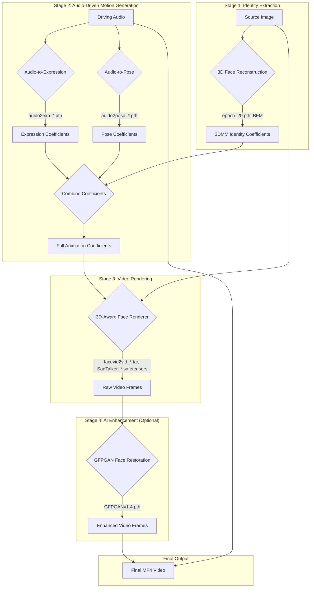

# Technical Overview: Digital Human RAG Agent

This document provides a detailed technical explanation of the Digital Human RAG Agent, covering the system architecture, AI pipeline, and the specific models required for each stage of the generation process.

## System Architecture

The application is built on a modular pipeline that orchestrates several specialized AI models to create a final video product. The backend is designed to be run locally and is optimized for different hardware configurations, including Apple Silicon (MPS), NVIDIA GPUs (CUDA), and CPU-only setups.

```mermaid
graph TD
    subgraph User Interface
        A[Web Interface (HTML/CSS/JS)]
    end

    subgraph Backend Server (Python/Flask)
        B[Web Server: src/main.py]
    end

    subgraph AI Pipeline Stages
        D[1. LLM Prompt Generation<br>(src/llm.py)]
        E[2. Image Generation<br>(src/image_generator.py)]
        F[3. Audio Generation<br>(src/audio_generator.py)]
        G[4. Video Generation<br>(src/video_generator.py)]
    end

    subgraph Core Models
        H[LLM (Ollama/Gemma)]
        I[Image Model (Stable Diffusion)]
        J[TTS Model (gTTS)]
        K[Video Models (SadTalker & GFPGAN)]
    end
    
    A -- HTTP Request (Character, Script) --> B
    B -- Invokes --> D
    B -- Invokes --> E
    B -- Invokes --> F
    B -- Invokes --> G
    
    D -- Uses --> H
    E -- Uses --> I
    F -- Uses --> J
    G -- Uses --> K

    subgraph Outputs
        O1[Detailed Image Prompt]
        O2[Source Image (.png)]
        O3[Voiceover Audio (.wav)]
        O4[Final Video (.mp4)]
    end

    D --> O1
    E --> O2
    F --> O3
    G --> O4
```

## Required Models & Files (7.6 GB Total)

The application relies on a collection of pre-trained models that must be downloaded before use. These files are not included in the git repository due to their large size. The `download_models.sh` script automates the download process.

### 1. SadTalker Models (~4.1 GB)

These models are the core of the video generation stage, responsible for animating the static source image.

| File                                | Size   | Purpose                                                                                             |
| ----------------------------------- | ------ | --------------------------------------------------------------------------------------------------- |
| `facevid2vid_00189-model.pth.tar`   | 2.0 GB | The main model for generating video frames by animating facial landmarks.                           |
| `SadTalker_V0.0.2_512.safetensors`  | 704 MB | The primary SadTalker model weights for generating 512x512 resolution videos.                       |
| `SadTalker_V0.0.2_256.safetensors`  | 705 MB | Alternative model weights for generating 256x256 resolution videos (faster, lower quality).        |
| `epoch_20.pth`                      | 288 MB | A foundational training checkpoint required by the core animation model.                            |
| `mapping_00229-model.pth.tar`       | 148 MB | A 3D mapping model used for deconstructing the face into a controllable mesh.                     |
| `mapping_00109-model.pth.tar`       | 160 MB | An alternative 3D mapping model.                                                                    |
| `shape_predictor_68_face_landmarks.dat` | 97 MB  | A Dlib model for detecting 68 specific facial landmarks (eyes, nose, mouth) in the source image. |
| `auido2pose_00140-model.pth`        | 91 MB  | A deep learning model that predicts head pose and movement from the input audio.                    |
| `auido2exp_00300-model.pth`         | 33 MB  | A model that predicts facial expressions (like blinks) from the audio to create natural movement. |

### 2. GFPGAN Models (~739 MB)

GFPGAN (Generative Facial Prior) is used as an optional final step in the video rendering pipeline to enhance the quality of the generated faces.

| File                      | Size   | Purpose                                                                        |
| ------------------------- | ------ | ------------------------------------------------------------------------------ |
| `GFPGANv1.4.pth`          | 333 MB | The main weights for the GFPGAN face restoration model.                        |
| `detection_Resnet50_Final.pth` | 255 MB | A ResNet50 model used for detecting faces within the video frames.             |
| `parsing_parsenet.pth`    | 4.4 MB | A model used for parsing facial components (eyes, mouth) to apply enhancements. |
| `alignment_WFLW_4HG.pth`  | 146 MB | A model for aligning facial features before enhancement.                       |

### 3. Other Required Models (~1.7 GB)

These models are used in the initial stages of the pipeline for image and audio generation.

-   **Stable Diffusion (`stabilityai/stable-diffusion-2-1-base`)**:
    -   **Size**: ~1.7 GB
    -   **Purpose**: This is the core image generation model. It takes a detailed text prompt and generates the initial 512x512 character avatar. The model is downloaded automatically by the Hugging Face `diffusers` library on first use and cached locally.
-   **Google Text-to-Speech (gTTS)**:
    -   **Size**: N/A (API-based, but runs locally)
    -   **Purpose**: Converts the input text script into a spoken voiceover. It does not require a separate model download but relies on the `gTTS` library.

## Step-by-Step Generation Flow

The video creation process is a sequence of four main stages, orchestrated by `src/main.py`.

### 1. Stage 1: LLM Prompt Generation

-   **Files**: `src/llm.py`, `prompts/image_prompt.txt`
-   **Model**: Ollama `gemma:2b` (or other local LLM)
-   **Process**: The user's brief character description (e.g., "A confident CEO") is expanded by the LLM into a detailed, descriptive prompt suitable for Stable Diffusion. The prompt template instructs the LLM to request a **passport-style, front-facing headshot**, which is the ideal input format for SadTalker.

### 2. Stage 2: Avatar Image Creation

-   **File**: `src/image_generator.py`
-   **Model**: `stabilityai/stable-diffusion-2-1-base`
-   **Process**: The `DiffusionPipeline` from Hugging Face uses the detailed prompt to generate a 512x512 image. The system is optimized for MPS (Apple Silicon), CUDA (NVIDIA), and has a CPU fallback to ensure compatibility. The final image is saved to `output/images/source_image.png`.

### 3. Stage 3: Voiceover Synthesis

-   **File**: `src/audio_generator.py`
-   **Model**: `gTTS`
-   **Process**: The user's script is converted into an MP3 audio file by `gTTS`. This is then post-processed using `ffmpeg` into a **16000 Hz mono WAV file**, which is the required input format for SadTalker's audio-to-pose model. The final audio is saved to `output/audio/audio.wav`.

### 4. Stage 4: Lip-Synced Video Rendering

-   **File**: `src/video_generator.py`
-   **Models**: SadTalker, GFPGAN
-   **Process**:
    1.  The `SadTalker/inference.py` script is called as a subprocess with the paths to the generated image and audio.
    2.  **Facial Landmark Detection**: SadTalker first uses the `shape_predictor_68_face_landmarks.dat` model to identify key points on the face.
    3.  **Audio-to-Motion**: The `auido2pose` and `auido2exp` models analyze the audio waveform to predict realistic head movements and expressions (blinking).
    4.  **Animation**: The core `facevid2vid` model uses this motion data to animate the static source image frame by frame.
    5.  **Enhancement (Optional)**: If enabled, `GFPGAN` is used to restore and enhance the facial details in each frame, improving overall visual quality.
    6.  The frames are compiled into a final MP4 video and saved to `output/videos/generated_video.mp4`.

This detailed, multi-stage process ensures that each component is optimized for its specific task, resulting in a high-quality, AI-generated digital human video.

### Detailed End-to-End Workflow

The Digital Human RAG Agent generates video through a sophisticated, multi-stage pipeline. It is designed to first understand the static identity of the person in the source image and then animate it using the audio. This decoupling of identity from motion is the key to producing high-quality, identity-preserving results.



#### Stage 1: Identity Extraction (3D Face Reconstruction)

The first step is to create a digital representation of the person's face from the source image. This establishes the unique "identity" that will be animated.

*   **Input**: A single source image (`source_image.png`).
*   **Core Model**: `epoch_20.pth` (a ResNet-50 network from Microsoft's **Deep3DFaceReconstruction** project).
*   **Supporting Models**: `BFM_model_front.mat` (The Basel Face Model provides a generic 3D face template), `shape_predictor_68_face_landmarks.dat` (dlib's facial landmark detector).
*   **Process**:
    1.  The system crops the input image and uses dlib to detect 68 key facial landmarks (corners of eyes, nose, mouth, etc.).
    2.  The `epoch_20.pth` model takes the cropped image and analyzes its geometry and texture. Through a process called "weakly-supervised learning," it fits the Basel Face Model to the image, generating a set of **3D Morphable Model (3DMM) coefficients**.
    3.  These coefficients are a compact vector of numbers that define the face's intrinsic properties:
        *   **Identity (`id_coeff`)**: The fundamental 3D shape of the face.
        *   **Texture (`tex_coeff`)**: The color and detail of the skin (albedo).
    4.  The output of this stage is a `.mat` file containing these static coefficients, which serve as the unchanging foundation for the animation.

#### Stage 2: Audio-Driven Motion Generation

This stage generates the dynamic facial movements and head poses directly from the audio file.

*   **Input**: The driving audio file (`driven_audio.wav`) and the static identity coefficients from Stage 1.
*   **Core Models**:
    *   `auido2exp_00300-model.pth` (**ExpNet**): A dedicated network that translates audio signals into expressive facial muscle movements.
    *   `auido2pose_00140-model.pth` (**PoseVAE**): A Variational Autoencoder that synthesizes natural, stylized head movements from the audio.
*   **Process**:
    1.  The audio waveform is processed by two networks simultaneously.
    2.  **ExpNet** focuses on the mouth and eye regions, generating a time-series of expression coefficients that dictate lip shape for each sound (phoneme) and add natural eye blinks.
    3.  **PoseVAE** analyzes the rhythm and prosody of the speech to generate a corresponding sequence of head poses (rotation and translation).
    4.  The resulting dynamic expression and pose coefficients are synchronized and combined with the static identity coefficients. This produces a final, comprehensive set of animation coefficients for the entire duration of the audio.

#### Stage 3: 3D-Aware Video Rendering

With the complete animation data prepared, this stage renders the final video frames.

*   **Input**: The full set of animation coefficients and the cropped source image.
*   **Core Models**: `SadTalker_V0.0.2_512.safetensors` and `facevid2vid_00189-model.pth.tar`. These models work together as the main face animation engine.
*   **Process**:
    1.  The rendering module (`AnimateFromCoeff`) iterates through the animation coefficients, one set for each frame of the output video.
    2.  In each frame, it constructs a 3D face mesh using the identity, expression, and pose coefficients for that specific moment in time.
    3.  It then projects the 2D texture from the original, cropped source image onto this 3D mesh, effectively "skinning" the model.
    4.  This process generates a raw video frame, which is stored in memory. This is repeated until all coefficients have been processed.

#### Stage 4: AI-Powered Enhancement (Optional)

This final, optional step uses a separate AI model to improve the realism of the generated frames.

*   **Input**: The raw video frames from Stage 3.
*   **Core Model**: `GFPGANv1.4.pth` (**Generative Facial Prior GAN**).
*   **Process**:
    1.  GFPGAN is a state-of-the-art "blind face restoration" model. It excels at taking low-quality or artificial-looking faces and making them photorealistic.
    2.  Each raw frame is passed through GFPGAN. The model enhances details like eye reflections, skin pores, and hair texture, while correcting any subtle color or lighting inconsistencies.
    3.  This significantly boosts the perceptual quality of the final output.

#### Final Output

The processed (and optionally enhanced) frames are encoded into an MP4 video file, and the original driving audio is added as the soundtrack, resulting in the final, synchronized talking head video. 